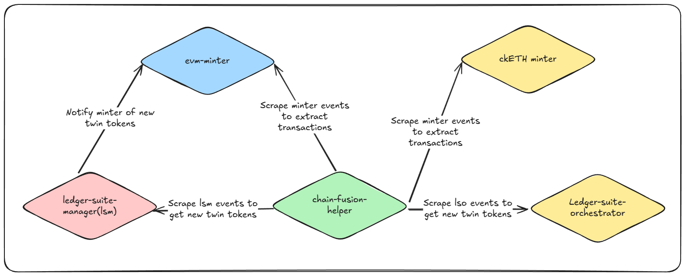

# 🛠️ Introduction

Welcome to the documentation for **Appic**, an innovative bridging solution enabling seamless interoperability between Ethereum Virtual Machine (EVM) chains and the Internet Computer (ICP). This guide is designed for developers aiming to gain a detailed understanding of Appic's architecture and functionality.

### 📘 Prerequisites

To effectively use this documentation, you should have:

- A foundational understanding of the **Internet Computer (ICP)** ecosystem.
- Familiarity with **EVM chains**, including their principles and workflows.

### 🌟 Overview

Appic establishes robust bridging between **EVM chains** and **ICP** using three core canisters:

1. [**evm-minter**](https://github.com/Appic-Solutions/evm-minter)
2. [**ledger-suite-manager (lsm)**](https://github.com/Appic-Solutions/ledger-suite-manager)
3. [**chain-fusion-helper**](https://github.com/Appic-Solutions/chain-fusion-helper)

These canisters work together to ensure secure, efficient, and decentralized cross-chain asset transfers.

---

## 🔒 evm-minter

The **evm-minter** facilitates token bridging by:

1. **Locking tokens** on the source EVM chain.
2. **Minting wrapped tokens** on the ICP platform.

### ✨ Use Cases

#### 1. Deposit (Lock Tokens)

Convert:

- **Native Tokens to Wrapped Tokens**
  - Example: BNB (EVM) ➔ icBNB (ICP)
- **ERC20 Tokens to Wrapped ERC20 Tokens**
  - Example: USDT (EVM) ➔ icUSDT (ICP)

#### 2. Withdrawal (Unlock Tokens)

Reverse conversion:

- **Wrapped Tokens to Native Tokens**
  - Example: icBNB (ICP) ➔ BNB (EVM)
- **Wrapped ERC20 Tokens to ERC20 Tokens**
  - Example: icUSDT (ICP) ➔ USDT (EVM)

### 🔐 Security Features

The **evm-minter** ensures secure operations using:

- **EVM RPC canister** for reliable cross-chain communication.
- **Threshold ECDSA signing** for tamper-resistant validation.

The Internet Computer's features eliminate off-chain dependencies, enhancing security and efficiency. Refunds are processed immediately if transactions fail.

### 📄 Integration Guide

- [Deposit Flow:](./minter/deposit.md)
- [Withdrawal Flow:](./minter/withdrawal.md)

---

## 📋 ledger-suite-manager (lsm)

The **lsm** canister manages and creates wrapped tokens on ICP by:

1. **Creating new twin tokens** for EVM assets.
2. **Maintaining Ledger Suites** (Ledger, Index, Archive).
3. **Upgrading Ledger Suites** when necessary.

### 🔧 Use Case: Twin Token Creation

Developers and users can create ICP-wrapped tokens for EVM assets supported by an evm-minter. Fees are paid in **ICP** or **Appic tokens**, and the process is fully automated through on-chain logic.

### 📄 Integration Guide

- [Twin Token Creation:](./lsm/create_twins.md)

---

## 🔍 chain-fusion-helper

The **chain-fusion-helper** canister serves as a support module, providing essential data and tools for bridging operations.

### 🔑 Key Features

- **Transaction Data Management**: Integrates with minters (e.g., ckETH, Appic EVM minters) to aggregate and organize data.
- **Query Endpoints**: Retrieve bridge transaction history using EVM wallet addresses or ICP principal IDs.
- **Comprehensive Token Data**:
  - Lists over 1,000 EVM tokens across major chains.
  - Provides ICP token prices in real-time.
  - Details bridgeable tokens between ICP and EVM.
  - Tracks wrapped tokens created via **lsm**.

By centralizing this information, the **chain-fusion-helper** simplifies bridging, making it accessible and efficient for developers and users alike.

### 📄 Integration Guide

- [Get chain fusion data:](./chain-fusion-helper/chain_fusion_data.md)
