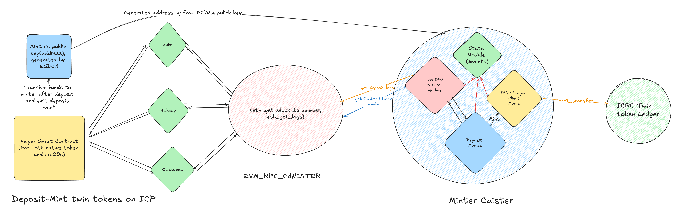

## 💰 Deposit Flow Guide

This guide explains the **deposit process** for transferring native and ERC20 tokens to the **minter canister** and minting twin tokens on ICP.

### 🖼️ Overview



The deposit process starts when a user calls the `deposit` function in the **helper smart contract**. This function supports both **native tokens** and **ERC20 tokens**. Tokens are transferred to an account generated with **ECDSA** for the minter canister, and an event is logged to track the deposit.

### 📋 Supported Chains

| **Chain**           | **Contract Address**                         | **Deposit Time**        |
| ------------------- | -------------------------------------------- | ----------------------- |
| Binance Smart Chain | `0x8f45574222F7372E23b5e9b1900abaeAA7571119` | 30 seconds to 3 minutes |

_This list will be updated as more EVM chains are supported._

### 🔄 Deposit Function

#### Solidity Function:

```solidity
/**
 * @dev Locks the specified amount of tokens or native currency from the user.
 * Transfers the assets to the minter address.
 * @param token The address of the token to lock. Use `address(0)` for native currency.
 * @param amount The amount of tokens to lock.
 * @param principal A unique identifier associated with the lock operation.
 */
function deposit(address token, uint256 amount, bytes32 principal, bytes32 subaccount) external payable;
```

#### How It Works:

1. **Native Tokens**:
   - Pass `msg.value` with the required amount.
2. **ERC20 Tokens**:
   - Approve the contract to spend tokens before calling the `deposit` function.

#### Example:

- For **native tokens**, ensure `msg.value` is set to the deposit amount.
- For **ERC20 tokens**, call the contract’s `approve` function to set the allowance.

### 🔍 After Deposit

1. **Funds Transfer**:
   The funds are transferred to the minter canister’s account, generated using its **ECDSA public key**.

2. **Log Collection**:

   - Deposit logs are collected using multiple **RPC providers** for reliability.
   - The `eth_getLogs` function is called regularly, with timing adjusted to match the chain’s block speed.

3. **Event Recording**:
   - Valid deposit logs are saved as **deposit events**.
   - Logs with errors (e.g., invalid principals or ERC20 addresses) are stored as **invalid deposit events**.

### 🛠️ Minting Twin Tokens

1. **Triggering the Mint Function**:
   After deposit events are recorded, a **timer** triggers the **mint function** in the minter canister.

2. **Minted Tokens**:

   - Based on the recorded deposit events, twin tokens are minted on ICP.
   - The minted tokens are transferred to the user’s account.

3. **Event Logging**:
   Minting actions are logged in the canister’s state for future reference.

### ⚠️ Error Handling

1. **Invalid Deposits**:

   - Logs with invalid data (e.g., incorrect principals or token addresses) are flagged as **invalid deposit events**.

2. **Resolutions**:
   - Check if the provided parameters match the required format.
   - Ensure sufficient allowance is set for ERC20 tokens.
