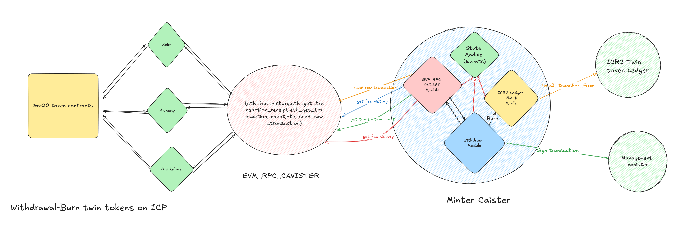

## 🔄 Withdrawal Flow Guide

This guide explains the **withdrawal process** for transferring twin tokens from ICP to EVM chains.

### 🖼️ Overview



The withdrawal process begins when a user approves the burning of tokens on ICP for the minter’s principal address and calls either the `withdraw_native_token` or `withdraw_erc20` function from the canister’s interface.

### 📋 Supported Chains

| **Chain**           | **Minter Canister ID**        | **Withdrawal Time**     |
| ------------------- | ----------------------------- | ----------------------- |
| Binance Smart Chain | `2ztvj-yaaaa-aaaap-ahiza-cai` | 30 seconds to 3 minutes |

_This list will be updated as more EVM chains are supported._

---

### 💰 Native Token Withdrawal

1. **Approval:**
   Approve the minter to burn the twin token.

   ```bash
   dfx canister call n44gr-qyaaa-aaaam-qbuha-cai icrc2_approve \
   "(record { amount = 2_000_000_000_000_000_000; spender = record { owner = principal \"2ztvj-yaaaa-aaaap-ahiza-cai\";} })" --network ic
   ```

2. **Call `withdraw_native_token`:**
   Pass the withdrawal parameters.

   ```candid
   type WithdrawalArg = record {
     recipient : text; // EVM address
     amount : nat;     // Amount to withdraw in raw format
   };
   ```

3. **Example:**
   Call the `withdraw_native_token` function:
   ```bash
   dfx canister call <minter_canister_id> withdraw_native_token "(record { recipient = \"0xYourEvmAddress\"; amount = 1000000000000000000 })"
   ```

### 💵 ERC20 Token Withdrawal

1. **Approval for Native Token Fee:**
   Approve the required twin native token (e.g., icBNB for BSC).

   ```bash
   dfx canister call n44gr-qyaaa-aaaam-qbuha-cai icrc2_approve \
   "(record { amount = 2_000_000_000_000_000; spender = record { owner = principal \"2ztvj-yaaaa-aaaap-ahiza-cai\";} })" --network ic
   ```

2. **Approval for ERC20 Token:**
   Approve the ERC20 twin token (e.g., icUSDT.bsc).

   ```bash
   dfx canister call pd4vj-oqaaa-aaaar-qahwq-cai icrc2_approve \
   "(record { amount = 1_000_000_000_000_000_000; spender = record { owner = principal \"2ztvj-yaaaa-aaaap-ahiza-cai\";} })" --network ic
   ```

3. **Call `withdraw_erc20`:**
   Pass the withdrawal parameters.

   ```candid
   type WithdrawErc20Arg = record {
     erc20_ledger_id : principal; // Ledger ID for the ERC20 twin token
     recipient : text;           // EVM address
     amount : nat;               // Amount to withdraw in raw format
   };
   ```

4. **Example:**
   ```bash
   dfx canister call <minter_canister_id> withdraw_erc20 "(record { erc20_ledger_id = principal \"ledger_id_here\"; recipient = \"0xYourEvmAddress\"; amount = 1000000000000000000 })"
   ```

---

### 📉 Handling Errors

1. **Insufficient Allowance:**
   Ensure the approval amount matches or exceeds the required withdrawal amount.

2. **Minimum Withdrawal Amount:**
   Fetch the minimum amount by calling:

   ```candid
   get_minter_info : () -> (MinterInfo) query;
   ```

3. **Error Types:**
   ```candid
   type WithdrawalError = variant {
     TemporarilyUnavailable : text;
     InvalidDestination : text;
     InsufficientAllowance : record { allowance : nat };
     AmountTooLow : record { min_withdrawal_amount : nat };
     InsufficientFunds : record { balance : nat };
   };
   ```

### 🛠️ Withdrawal Request Processing

After a withdrawal request is created, it is saved in the **canister’s state** and processed in four steps:

1. **Create Transactions Batch:**
   `create_transactions_batch()`

2. **Sign Transactions Batch:**
   `sign_transactions_batch()`

3. **Send Transactions Batch:**
   `send_transactions_batch()`

4. **Finalize Transactions Batch:**
   `finalize_transactions_batch()`

If a transaction fails due to low gas, it is retried with a 10% gas increase. For other failures, the twin tokens are refunded on ICP.
